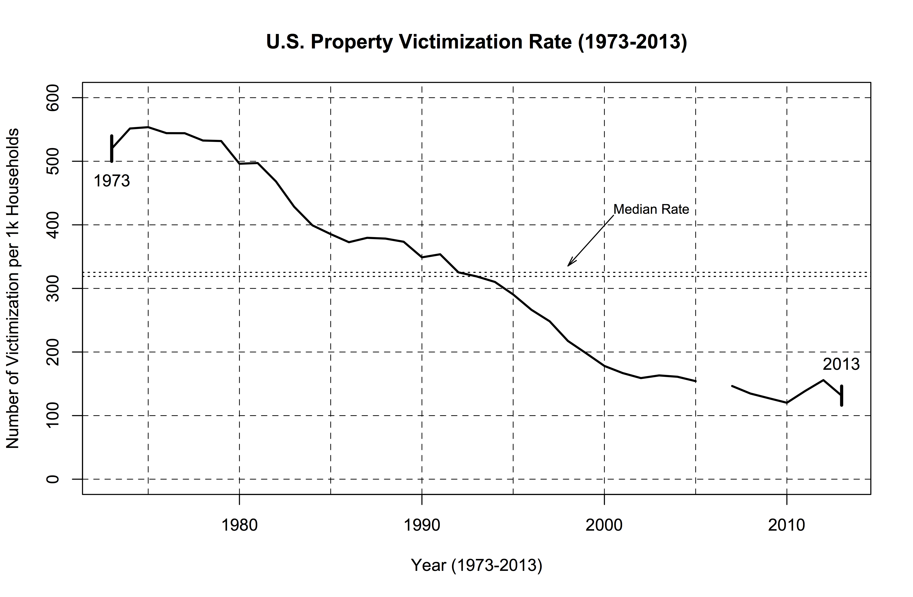
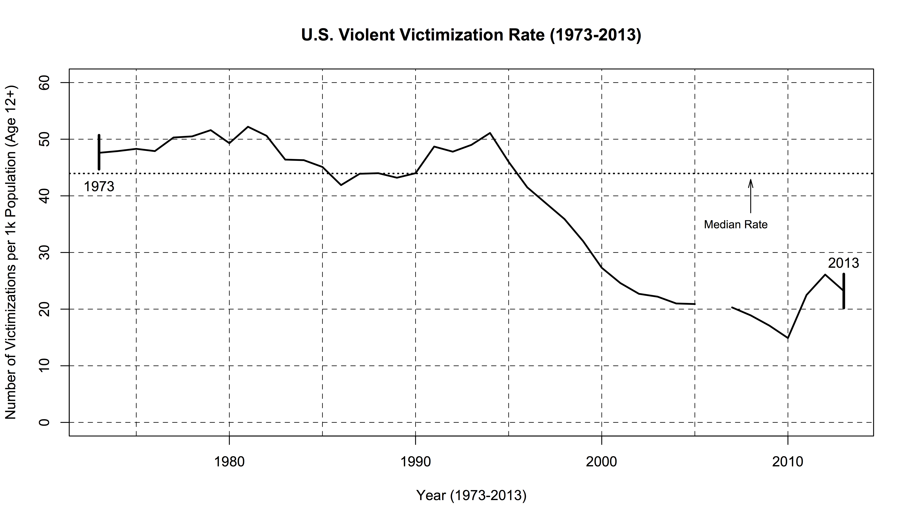

# Long-Term NCVS Victimization Patterns

This R code plots the violent and property victimization rates from the
National Crime Victimization Survey (NCVS) from 1973 to 2013. Details 
about the National Crime Victimization Survey are available at the [U.S. Bureau of Justice Statistics](http://www.bjs.gov/index.cfm?ty=dcdetail&iid=245). Here are a few additional notes about the data and the plots:

* I have the yearly time series of violent and property victimization 
rates from tables that were previously published at the BJS website (to 
my knowledge, those tables are no longer posted at the BJS website). These are
included as pdf files in the repository. The tables are still available via
the Internet Archive at these links: [violent victimizations](https://web.archive.org/web/20130118234458/http://bjs.ojp.usdoj.gov/content/glance/tables/viortrdtab.cfm) and [property victimizations](https://web.archive.org/web/20111202180413/http://bjs.ojp.usdoj.gov/content/glance/tables/proptrdtab.cfm). 

* The tables cover the period from 1973-2008. The violent tables include estimated homicide rates from the FBI's homicide reporting program. Throughout the time series, each year's estimated homicide rate contributes 0.1 victimizations per 1,000 persons age 12 and over. To make the series comparable with the period after 2008, I subtracted 0.1 from each year's violent victimization rate. Also,
there is a footnote on the tables which states that the 1973-1991 series was adjusted to improve comparability between the NCVS before and after a 1992 redesign of the survey.

* Violent victimization rates capture victimizations due to rape, robbery, and assault. The rates are expressed in terms of the number of victimizations per 1,000 U.S. persons age 12 and over. 

* Property victimization rates are measured in terms of households experiencing burglary, larceny (theft), and motor vehicle theft. The rates are expressed in terms of the number of households experiencing victimizations per 1,000 U.S. households.

* Data from 2009-2013 come directly from the NCVS bulletins published by BJS. Currently, the links for these bulletins are: [2009](http://www.bjs.gov/content/pub/pdf/cv09.pdf), [2010](http://www.bjs.gov/content/pub/pdf/cv10.pdf), [2011](http://www.bjs.gov/content/pub/pdf/cv11.pdf), [2012](http://www.bjs.gov/content/pub/pdf/cv12.pdf), [2013](http://www.bjs.gov/content/pub/pdf/cv13.pdf), and the [2018 report](https://www.bjs.gov/content/pub/pdf/cv18.pdf) contains the information from 2014-2018.

* The methods for collecting the data in 2006 were not comparable to those used in other years; therefore, 2006 is not included in the charts.

* Each plot also presents lower and upper bounds on the median. The median is not point-identified because the 2006 rates are missing. Therefore, I calculate the median under the assumption that the 2006 rate attains the lower bound and symmetrically under the assumption that the 2006 rate attains the upper bound. Both bounds are presented in the figures. As the figures suggest, these bounds are narrow (particularly for violent crimes) so the missing data for 2006 has little effect on our conclusions about the median annual victimization rate.

* Here is the property victimization rate plot:

<p align="center">

</p>

* And, here is a plot of the violent victimization rate:

<p align="center">

</p>

This is the R code used to generate the plots:

```R
# specify the range of years

year <- seq(from=1973,to=2018,by=1)

# enter property victimization rates

p <- c(519.9,551.5,553.6,544.2,544.1,532.6,531.8,496.1,497.2,468.3,
       428.4,399.2,385.4,372.7,379.6,378.4,373.4,348.9,353.7,325.3,
       318.9,310.2,290.5,266.4,248.3,217.4,198.0,178.1,166.9,159.0,
       163.2,161.1,154.2,NA,146.5,134.7,127.4,120.2,138.7,155.8,
       131.4,118.1,110.7,118.6,108.4,108.2)

# enter violent victimization rates

v <- c(47.7,48.0,48.4,48.0,50.4,50.6,51.7,49.4,52.3,50.7,46.5,46.4,
       45.2,42.0,44.0,44.1,43.3,44.1,48.8,47.9,49.1,51.2,46.1,41.6,
       38.8,36.0,32.1,27.4,24.7,22.8,22.3,21.1,21.0,NA,20.4,19.0,
       17.1,14.9,22.5,26.1,23.2,20.1,18.6,19.7,20.6,23.2)

# purge homicides from personal victimization rates

vadj <- c(v[1:36]-0.1,v[37:46])

# print out the data set

df <- data.frame(year,p,v,vadj)
df

# calculate bounds on the median

vlb <- ifelse(is.na(vadj),min(vadj,na.rm=T),vadj)
vub <- ifelse(is.na(vadj),max(vadj,na.rm=T),vadj)
mvlb <- median(vlb)
mvub <- median(vub)
mvlb
mvub

plb <- ifelse(is.na(p),min(p,na.rm=T),p)
pub <- ifelse(is.na(p),max(p,na.rm=T),p)
mplb <- median(plb)
mpub <- median(pub)
mplb
mpub

# create line plot for property rates

plot(x=year,y=p,type="l",lty=1,lwd=2,ylim=c(0,600),
  xlab="Year (1973-2018)",
  ylab="Number of Victimization per 1k Households",
  main="U.S. Property Victimization Rate (1973-2018)")
segments(x0=min(year),y0=p[1]-20,
         x1=min(year),y1=p[1]+20,
         lty=1,lwd=3)
segments(x0=max(year),y0=p[length(p)]-15,
         x1=max(year),y1=p[length(p)]+15,
         lty=1,lwd=3)
abline(h=seq(from=0,to=600,by=100),lty=2,lwd=0.7)
abline(v=seq(from=1975,to=2015,by=5),lty=2,lwd=0.7)
abline(h=mplb,lty=3,lwd=1.0)
abline(h=mpub,lty=3,lwd=1.0)
text(x=min(year),y=p[1]-50,"1973",family="Arial")
text(x=max(year),y=p[length(p)]+50,"2018",family="Arial")
text(x=2000.5,y=425,adj=c(0,0.5),"Median Rate",cex=0.8,family="Arial")
arrows(x0=2000.5,y0=415,
       x1=1998,y1=mpub+10,
       code=2,length=0.1,angle=15)

# create line plot for violent rates

plot(x=year,y=vadj,type="l",lty=1,lwd=2,ylim=c(0,60),
  xlab="Year (1973-2018)",
  ylab="Number of Victimizations per 1k Population (Age 12+)",
  main="U.S. Violent Victimization Rate (1973-2018)")
segments(x0=min(year),y0=v[1]-3,
         x1=min(year),y1=v[1]+3,
         lty=1,lwd=3)
segments(x0=max(year),y0=v[length(v)]-3,
         x1=max(year),y1=v[length(v)]+3,
         lty=1,lwd=3)
abline(h=seq(from=0,to=60,by=10),lty=2,lwd=0.7)
abline(v=seq(from=1975,to=2015,by=5),lty=2,lwd=0.7)
abline(h=mvlb,lty=3,lwd=1.0)
abline(h=mvub,lty=3,lwd=1.0)
text(x=min(year),y=v[1]+6,"1973",family="Arial")
text(x=max(year),y=v[length(v)]+5,"2018",family="Arial")
abline(h=mplb,lty=3,lwd=1.0)
abline(h=mpub,lty=3,lwd=1.0)
text(x=2005.5,y=35,adj=c(0,0.5),"Median Rate",cex=0.8,family="Arial")
arrows(x0=2008,y0=37,
       x1=2008,y1=mvlb-1,
       code=2,length=0.1,angle=15)
```

and here is the output:

```
> # specify the range of years
> 
> year <- seq(from=1973,to=2018,by=1)
> 
> # enter property victimization rates
> 
> p <- c(519.9,551.5,553.6,544.2,544.1,532.6,531.8,496.1,497.2,468.3,
+        428.4,399.2,385.4,372.7,379.6,378.4,373.4,348.9,353.7,325.3,
+        318.9,310.2,290.5,266.4,248.3,217.4,198.0,178.1,166.9,159.0,
+        163.2,161.1,154.2,NA,146.5,134.7,127.4,120.2,138.7,155.8,
+        131.4,118.1,110.7,118.6,108.4,108.2)
> 
> # enter violent victimization rates
> 
> v <- c(47.7,48.0,48.4,48.0,50.4,50.6,51.7,49.4,52.3,50.7,46.5,46.4,
+        45.2,42.0,44.0,44.1,43.3,44.1,48.8,47.9,49.1,51.2,46.1,41.6,
+        38.8,36.0,32.1,27.4,24.7,22.8,22.3,21.1,21.0,NA,20.4,19.0,
+        17.1,14.9,22.5,26.1,23.2,20.1,18.6,19.7,20.6,23.2)
> 
> # purge homicides from personal victimization rates
> 
> vadj <- c(v[1:36]-0.1,v[37:46])
> 
> # print out the data set
> 
> df <- data.frame(year,p,v,vadj)
> df
   year     p    v vadj
1  1973 519.9 47.7 47.6
2  1974 551.5 48.0 47.9
3  1975 553.6 48.4 48.3
4  1976 544.2 48.0 47.9
5  1977 544.1 50.4 50.3
6  1978 532.6 50.6 50.5
7  1979 531.8 51.7 51.6
8  1980 496.1 49.4 49.3
9  1981 497.2 52.3 52.2
10 1982 468.3 50.7 50.6
11 1983 428.4 46.5 46.4
12 1984 399.2 46.4 46.3
13 1985 385.4 45.2 45.1
14 1986 372.7 42.0 41.9
15 1987 379.6 44.0 43.9
16 1988 378.4 44.1 44.0
17 1989 373.4 43.3 43.2
18 1990 348.9 44.1 44.0
19 1991 353.7 48.8 48.7
20 1992 325.3 47.9 47.8
21 1993 318.9 49.1 49.0
22 1994 310.2 51.2 51.1
23 1995 290.5 46.1 46.0
24 1996 266.4 41.6 41.5
25 1997 248.3 38.8 38.7
26 1998 217.4 36.0 35.9
27 1999 198.0 32.1 32.0
28 2000 178.1 27.4 27.3
29 2001 166.9 24.7 24.6
30 2002 159.0 22.8 22.7
31 2003 163.2 22.3 22.2
32 2004 161.1 21.1 21.0
33 2005 154.2 21.0 20.9
34 2006    NA   NA   NA
35 2007 146.5 20.4 20.3
36 2008 134.7 19.0 18.9
37 2009 127.4 17.1 17.1
38 2010 120.2 14.9 14.9
39 2011 138.7 22.5 22.5
40 2012 155.8 26.1 26.1
41 2013 131.4 23.2 23.2
42 2014 118.1 20.1 20.1
43 2015 110.7 18.6 18.6
44 2016 118.6 19.7 19.7
45 2017 108.4 20.6 20.6
46 2018 108.2 23.2 23.2
> 
> # calculate bounds on the median
> 
> vlb <- ifelse(is.na(vadj),min(vadj,na.rm=T),vadj)
> vub <- ifelse(is.na(vadj),max(vadj,na.rm=T),vadj)
> mvlb <- median(vlb)
> mvub <- median(vub)
> mvlb
[1] 41.7
> mvub
[1] 42.55
> 
> plb <- ifelse(is.na(p),min(p,na.rm=T),p)
> pub <- ifelse(is.na(p),max(p,na.rm=T),p)
> mplb <- median(plb)
> mpub <- median(pub)
> mplb
[1] 278.45
> mpub
[1] 300.35
> 
> # create line plot for property rates
> 
> plot(x=year,y=p,type="l",lty=1,lwd=2,ylim=c(0,600),
+   xlab="Year (1973-2018)",
+   ylab="Number of Victimization per 1k Households",
+   main="U.S. Property Victimization Rate (1973-2018)")
> segments(x0=min(year),y0=p[1]-20,
+          x1=min(year),y1=p[1]+20,
+          lty=1,lwd=3)
> segments(x0=max(year),y0=p[length(p)]-15,
+          x1=max(year),y1=p[length(p)]+15,
+          lty=1,lwd=3)
> abline(h=seq(from=0,to=600,by=100),lty=2,lwd=0.7)
> abline(v=seq(from=1975,to=2015,by=5),lty=2,lwd=0.7)
> abline(h=mplb,lty=3,lwd=1.0)
> abline(h=mpub,lty=3,lwd=1.0)
> text(x=min(year),y=p[1]-50,"1973",family="Arial")
> text(x=max(year),y=p[length(p)]+50,"2018",family="Arial")
> text(x=2000.5,y=425,adj=c(0,0.5),"Median Rate",cex=0.8,family="Arial")
> arrows(x0=2000.5,y0=415,
+        x1=1998,y1=mpub+10,
+        code=2,length=0.1,angle=15)
> 
> # create line plot for violent rates
> 
> plot(x=year,y=vadj,type="l",lty=1,lwd=2,ylim=c(0,60),
+   xlab="Year (1973-2018)",
+   ylab="Number of Victimizations per 1k Population (Age 12+)",
+   main="U.S. Violent Victimization Rate (1973-2018)")
> segments(x0=min(year),y0=v[1]-3,
+          x1=min(year),y1=v[1]+3,
+          lty=1,lwd=3)
> segments(x0=max(year),y0=v[length(v)]-3,
+          x1=max(year),y1=v[length(v)]+3,
+          lty=1,lwd=3)
> abline(h=seq(from=0,to=60,by=10),lty=2,lwd=0.7)
> abline(v=seq(from=1975,to=2015,by=5),lty=2,lwd=0.7)
> abline(h=mvlb,lty=3,lwd=1.0)
> abline(h=mvub,lty=3,lwd=1.0)
> text(x=min(year),y=v[1]+6,"1973",family="Arial")
> text(x=max(year),y=v[length(v)]+5,"2018",family="Arial")
> abline(h=mplb,lty=3,lwd=1.0)
> abline(h=mpub,lty=3,lwd=1.0)
> text(x=2005.5,y=35,adj=c(0,0.5),"Median Rate",cex=0.8,family="Arial")
> arrows(x0=2008,y0=37,
+        x1=2008,y1=mvlb-1,
+        code=2,length=0.1,angle=15)
> 
```
